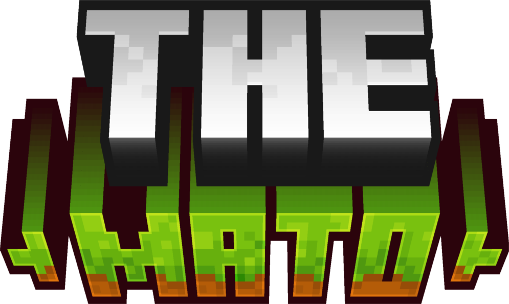

# 
 - The Mato - 

The Mato is a mod that adds new biomes, blocks, items and mobs related to either Brazil or other places, such as old *Minecraft* features.

Some ideas for this mod were by my friend Gabriel and by Sophie, such as a Honey Forest.

Here's a list of the current biomes available in the mod:
- **Ipe Forest** — A biome covered in pink, purple, red and yellow ipe trees, all with custom wood types;
- **The Woods** — A biome inspired by my name (JuneTheWoods). It has junium trees and will have lime green flowers;
- **Backported 1.18 Biomes** — Most of the new cliff biomes from 1.18 have been backported into this mod.